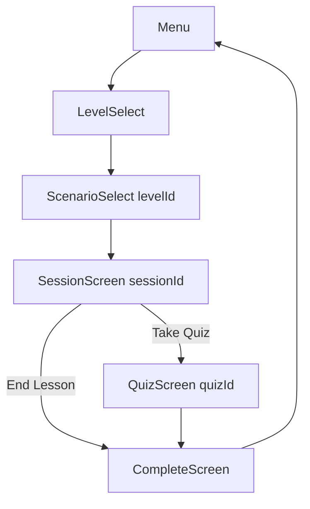
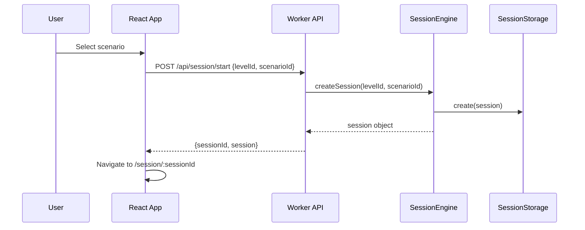
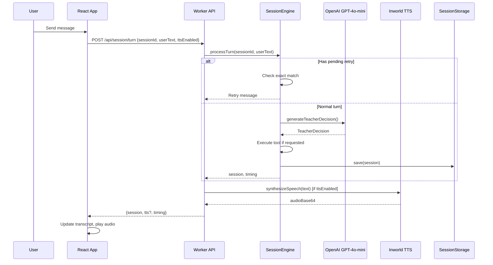
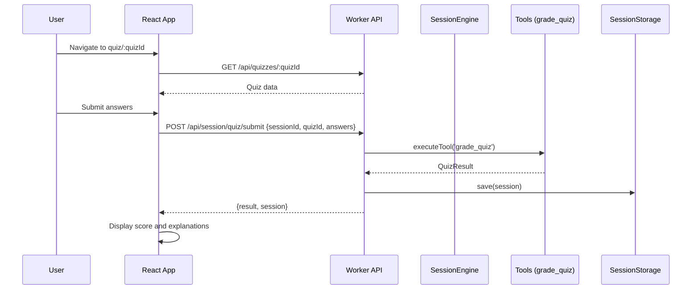

# Conversational Test App - Complete Project Breakdown

## Overview

A monorepo-based conversational language learning application built with React (Vite) for the frontend and Cloudflare Workers for the backend. The app enables users to practice Spanish through real-world conversation scenarios with an AI tutor.

---

## Project Structure

```
conversational-test-app/
├── apps/
│   ├── ui/                 # React frontend (Vite)
│   └── worker/             # Cloudflare Worker backend
├── packages/
│   └── shared/             # Shared TypeScript schemas
├── docs/                   # Documentation
├── plans/                  # Planning documents
└── pnpm-workspace.yaml     # Monorepo configuration
```

---

## Technology Stack

### Frontend (apps/ui)
- **Framework**: React 18 with TypeScript
- **Build Tool**: Vite
- **Routing**: React Router v6
- **Styling**: Tailwind CSS
- **Deployment**: Cloudflare Pages

### Backend (apps/worker)
- **Runtime**: Cloudflare Workers
- **Language**: TypeScript
- **AI/LLM**: OpenAI GPT-4o-mini
- **Speech-to-Text**: OpenAI Whisper (gpt-4o-mini-transcribe)
- **Text-to-Speech**: Inworld TTS
- **Storage**: Cloudflare Durable Objects (with in-memory fallback)

### Shared (packages/shared)
- **Validation**: Zod
- **TypeScript schemas** for content, sessions, STT, and timing

---

## Frontend Routes (React Router)

### Route Map

| Path | Component | Description |
|------|-----------|-------------|
| `/` | [`Menu`](apps/ui/src/screens/Menu.tsx:5) | Landing page with feature overview and CTA |
| `/levels` | [`LevelSelect`](apps/ui/src/screens/LevelSelect.tsx:7) | Browse and select difficulty levels |
| `/scenarios/:levelId` | [`ScenarioSelect`](apps/ui/src/screens/ScenarioSelect.tsx:18) | Choose a conversation scenario |
| `/session/:sessionId` | [`SessionScreen`](apps/ui/src/screens/SessionScreen.tsx:76) | Main conversation interface |
| `/quiz/:quizId` | [`QuizScreen`](apps/ui/src/screens/QuizScreen.tsx:41) | Take a quiz after scenario |
| `/complete` | [`CompleteScreen`](apps/ui/src/screens/CompleteScreen.tsx:28) | Session summary and next steps |

### Route Flow



---

## Backend API Routes (Cloudflare Worker)

### Route Handler Entry Point
- **File**: [`apps/worker/src/index.ts`](apps/worker/src/index.ts:301)

### API Endpoint Map

| Method | Path | Handler | Description |
|--------|------|---------|-------------|
| GET | `/health` | [`routeRequest`](apps/worker/src/index.ts:231) | Health check endpoint |
| POST | `/api/session/start` | [`SessionRouter.handleStartSession`](apps/worker/src/lib/sessions-router.ts:50) | Create new session |
| POST | `/api/session/turn` | [`SessionRouter.handleTurn`](apps/worker/src/lib/sessions-router.ts:89) | Send user message, get tutor response |
| POST | `/api/session/end` | [`SessionRouter.handleEndSession`](apps/worker/src/lib/sessions-router.ts:208) | End session, get summary |
| GET | `/api/session/:id` | [`SessionRouter.handleGetSession`](apps/worker/src/lib/sessions-router.ts:251) | Get session by ID |
| POST | `/api/session/quiz/submit` | [`SessionRouter.handleQuizSubmit`](apps/worker/src/lib/sessions-router.ts:292) | Submit quiz answers |
| GET | `/api/levels` | [`handleGetLevels`](apps/worker/src/index.ts:102) | Get all levels |
| GET | `/api/scenarios?level=X` | [`handleGetScenarios`](apps/worker/src/index.ts:129) | Get scenarios by level |
| GET | `/api/quizzes/:id` | [`handleGetQuiz`](apps/worker/src/index.ts:179) | Get quiz by ID |
| POST | `/api/stt/transcribe` | [`handleSttTranscribe`](apps/worker/src/lib/openai-stt.ts:192) | Transcribe audio to text |
| OPTIONS | `*` | [`handlePreflight`](apps/worker/src/index.ts:55) | CORS preflight handler |

### Content API Aliases

| Alias | Maps To | Description |
|-------|--------|-------------|
| `/api/content/levels` | `/api/levels` | Levels endpoint (alternative) |
| `/api/content/scenarios` | `/api/scenarios` | Scenarios endpoint (alternative) |
| `/api/content/quizzes/:id` | `/api/quizzes/:id` | Quiz endpoint (alternative) |

---

## Data Models

### Level Schema
```typescript
// File: packages/shared/src/schemas/content.ts:7
{
    id: string;          // e.g., "A1", "A2", "B1"
    name: string;        // Display name
    description: string; // Brief description
    order: number;       // Presentation order
}
```

### Persona Schema
```typescript
// File: packages/shared/src/schemas/content.ts:24
{
    id: string;          // e.g., "jorge", "valentina"
    name: string;        // Display name
    role: string;        // Occupation/role
    voiceId?: string;    // TTS voice identifier
    ttsVoiceId?: string; // Override for worker TTS
    instructions: string; // System prompt for persona behavior
}
```

### Scenario Schema
```typescript
// File: packages/shared/src/schemas/content.ts:73
{
    id: string;              // Unique scenario ID
    levelId: string;         // Reference to level
    title: string;           // Display title
    description: string;     // Brief description
    personaId: string;      // Reference to persona
    tags: string[];         // Categorization tags
    learningGoals: string[];  // Learning objectives
    initialMessage: string; // Tutor's first message
    successConditions: string[];  // Completion criteria
    conversationRules: string[];  // Guidelines for tutor
    postQuizId?: string;     // Optional quiz after scenario
}
```

### Quiz Schema
```typescript
// File: packages/shared/src/schemas/content.ts:58
{
    id: string;              // Unique quiz ID
    scenarioId?: string;     // Reference to scenario
    items: QuizItem[];      // Array of questions
}

QuizItem {
    question: string;       // The question
    options: string[];      // Answer choices
    correctIndex: number;   // 0-based correct answer
    explanation?: string;    // Post-answer explanation
}
```

### Session State Schema
```typescript
// File: packages/shared/src/schemas/session.ts:65
{
    id: string;                  // UUID
    createdAt: string;           // ISO timestamp
    updatedAt: string;           // ISO timestamp
    levelId: string;             // Reference to level
    scenarioId: string;          // Reference to scenario
    phase: 'roleplay' | 'quiz' | 'completed';
    transcript: TranscriptMessage[];
    turnCount: number;           // Conversation turns
    mistakes: Mistake[];         // Tracked errors
    postQuizId?: string;         // Available quiz
    pendingRetry?: PendingRetry;  // Correction gating state
    lastDecision?: TeacherDecision; // Last AI decision
    activeQuiz?: ActiveQuiz;     // Quiz in progress
    quizResult?: QuizResult;     // Completed quiz score
    completion?: SessionCompletion; // Completion summary
}

TranscriptMessage {
    id: string;      // UUID
    role: 'user' | 'tutor';
    text: string;    // Message content
    ts: string;      // ISO timestamp
}
```

### Teacher Decision Schema
```typescript
// File: packages/shared/src/schemas/content.ts:320
{
    feedback: string;         // Feedback for student
    correction?: string;      // Corrected version
    isMistake: boolean;       // Was this a mistake?
    shouldRetry: boolean;    // Should student retry?
    nextPhase?: 'roleplay' | 'quiz' | 'completed';
    tool?: Tool | null;       // Server-authoritative tool
    reply: string;           // Tutor's response text (REQUIRED)
}
```

---

## Session Lifecycle

### 1. Session Creation


### 2. Conversation Turn


### 3. Quiz Flow


---

## Backend Components

### Session Engine
- **File**: [`apps/worker/src/lib/session-engine.ts`](apps/worker/src/lib/session-engine.ts:54)
- **Responsibilities**:
  - Session creation and state management
  - Turn processing with retry gating
  - Tool execution coordination
  - Session completion handling

### Session Router
- **File**: [`apps/worker/src/lib/sessions-router.ts`](apps/worker/src/lib/sessions-router.ts:37)
- **Responsibilities**:
  - HTTP request routing for session endpoints
  - TTS synthesis coordination
  - Request ID generation and logging

### Content Loader
- **File**: [`apps/worker/src/lib/content-loader.ts`](apps/worker/src/lib/content-loader.ts:93)
- **Responsibilities**:
  - Load and validate JSON content files
  - Query helpers for levels, scenarios, personas, quizzes
  - Cross-reference validation

### OpenAI Integration
- **File**: [`apps/worker/src/lib/openai.ts`](apps/worker/src/lib/openai.ts:75)
- **Responsibilities**:
  - Teacher decision generation via GPT-4o-mini
  - Tool narration generation
  - Fallback decision on API failure
  - Text normalization for exact-match comparison

### Tools System
- **File**: [`apps/worker/src/lib/tools.ts`](apps/worker/src/lib/tools.ts:32)
- **Available Tools**:
  - `start_quiz` - Initiate quiz for session
  - `grade_quiz` - Grade quiz answers
  - `get_hint` - Provide learning hint
  - `log_mistake` - Record student mistake
  - `mark_complete` - Mark session as complete

### STT Handler
- **File**: [`apps/worker/src/lib/openai-stt.ts`](apps/worker/src/lib/openai-stt.ts:192)
- **Endpoint**: `POST /api/stt/transcribe`
- **Model**: gpt-4o-mini-transcribe
- **Max Audio Size**: 10MB
- **Supported Formats**: webm, wav, mp3, mp4, m4a, aac, ogg, opus

### TTS Handler
- **File**: [`apps/worker/src/lib/inworld-tts.ts`](apps/worker/src/lib/inworld-tts.ts:70)
- **Provider**: Inworld AI
- **Max Text Length**: 1000 characters
- **Timeout**: 4 seconds
- **Output Format**: audio/mp3

### Session Storage
- **File**: [`apps/worker/src/lib/sessions-durable-object.ts`](apps/worker/src/lib/sessions-durable-object.ts:115)
- **Implementations**:
  - `InMemorySessionStorage` - Development fallback
  - `SessionsDurableObject` - Cloudflare DO persistence

---

## UI Components

### Component Library
**Directory**: [`apps/ui/src/components/`](apps/ui/src/components/)

| Component | File | Purpose |
|-----------|------|---------|
| Button | [`Button.tsx`](apps/ui/src/components/Button.tsx) | Primary action button |
| Card | [`Card.tsx`](apps/ui/src/components/Card.tsx) | Content container with variants |
| Tag | [`Tag.tsx`](apps/ui/src/components/Tag.tsx) | Category and level labels |
| Toggle | [`Toggle.tsx`](apps/ui/src/components/Toggle.tsx) | Switch controls |
| TranscriptBubble | [`TranscriptBubble.tsx`](apps/ui/src/components/TranscriptBubble.tsx) | Chat message display |
| ErrorDisplay | [`ErrorDisplay.tsx`](apps/ui/src/components/ErrorDisplay.tsx) | Error state with retry |
| LoadingSpinner | [`ErrorDisplay.tsx`](apps/ui/src/components/ErrorDisplay.tsx:50) | Loading indicator |

### Screen Components
**Directory**: [`apps/ui/src/screens/`](apps/ui/src/screens/)

| Screen | File | Features |
|--------|------|----------|
| Menu | [`Menu.tsx`](apps/ui/src/screens/Menu.tsx:5) | Landing page, feature overview |
| LevelSelect | [`LevelSelect.tsx`](apps/ui/src/screens/LevelSelect.tsx:7) | Level grid with cards |
| ScenarioSelect | [`ScenarioSelect.tsx`](apps/ui/src/screens/ScenarioSelect.tsx:18) | Scenario cards with tags |
| SessionScreen | [`SessionScreen.tsx`](apps/ui/src/screens/SessionScreen.tsx:76) | Chat, mic input, TTS toggle, debug panel |
| QuizScreen | [`QuizScreen.tsx`](apps/ui/src/screens/QuizScreen.tsx:41) | Quiz interface, answer selection, scoring |
| CompleteScreen | [`CompleteScreen.tsx`](apps/ui/src/screens/CompleteScreen.tsx:28) | Session summary, quiz results |

---

## API Client

**File**: [`apps/ui/src/lib/api.ts`](apps/ui/src/lib/api.ts:1)

### Content API Functions
| Function | Endpoint | Returns |
|----------|----------|---------|
| `getLevels()` | GET /api/levels | `Level[]` |
| `getScenarios(levelId)` | GET /api/scenarios?level=X | `Scenario[]` |
| `getQuiz(quizId)` | GET /api/quizzes/:id | `Quiz` |

### Session API Functions
| Function | Endpoint | Returns |
|----------|----------|---------|
| `startSession(levelId, scenarioId)` | POST /api/session/start | `{sessionId, session}` |
| `sendSessionTurn(sessionId, userText, ttsEnabled)` | POST /api/session/turn | `{session, tts?, timing}` |
| `endSession(sessionId)` | POST /api/session/end | `{session, summary}` |
| `getSession(sessionId)` | GET /api/session/:id | `{session}` |
| `submitQuizAnswers(sessionId, quizId, answers)` | POST /api/session/quiz/submit | `{result, session}` |

### STT API Function
| Function | Endpoint | Returns |
|----------|----------|---------|
| `transcribeAudio(sessionId, audioBlob, language, fileExtension)` | POST /api/stt/transcribe | `{text, requestId?, timing?}` |

---

## Content Packs

### Current Content

#### Levels
**File**: [`apps/worker/content/levels.json`](apps/worker/content/levels.json)

| ID | Name | Description |
|----|------|-------------|
| A1 | Beginner | Basic introductions, greetings, everyday phrases |
| A2 | Elementary | Common situations, routines, personal information |
| B1 | Intermediate | Opinions, experiences, future plans, travel |

#### Personas
**File**: [`apps/worker/content/personas.json`](apps/worker/content/personas.json)

| ID | Name | Role | Description |
|----|------|------|-------------|
| jorge | Jorge | Taxi Driver | Friendly Colombian taxi driver, informal, short responses |
| valentina | Valentina | Spanish Tutor | Patient tutor specializing in ser/estar, encouraging |

#### Scenarios
**File**: [`apps/worker/content/scenarios.json`](apps/worker/content/scenarios.json)

| ID | Level | Persona | Title | Quiz |
|----|-------|---------|-------|------|
| taxi-bogota | A1 | jorge | Taxi Ride in Bogotá | taxi-quiz |
| ser-estar-confusion | A1 | valentina | Ser vs Estar Confusion | - |

#### Quizzes
**File**: [`apps/worker/content/quizzes.json`](apps/worker/content/quizzes.json)

| ID | Scenario | Questions |
|----|----------|-----------|
| taxi-quiz | taxi-bogota | 4 questions |

---

## Environment Configuration

### Frontend
**File**: [`apps/ui/vite.config.ts`](apps/ui/vite.config.ts)

| Variable | Description |
|----------|-------------|
| `VITE_API_BASE_URL` | Override API base URL (optional) |

### Backend
**File**: [`apps/worker/wrangler.toml`](apps/worker/wrangler.toml)

| Variable | Description |
|----------|-------------|
| `OPENAI_API_KEY` | OpenAI API key for LLM and STT |
| `INWORLD_API_KEY` | Inworld API key for TTS |
| `INWORLD_TTS_VOICE` | Default TTS voice ID |
| `OPENAI_STT_MODEL` | STT model (default: gpt-4o-mini-transcribe) |
| `SESSIONS_DO` | Durable Object binding |

---

## Key Features

### Speech Recognition
- **Technology**: OpenAI Whisper (gpt-4o-mini-transcribe)
- **Input**: Microphone recording via MediaRecorder API
- **Formats**: webm (preferred), mp4, m4a, wav
- **Language**: Spanish (hardcoded 'es' hint)
- **Fallback**: Typed text input

### Text-to-Speech
- **Technology**: Inworld TTS
- **Trigger**: Optional toggle in session screen
- **Voice**: Persona-specific voices (configurable)
- **Playback**: HTML5 Audio API
- **Fallback**: Toggleable off for cost savings

### AI Tutor
- **Model**: GPT-4o-mini
- **Persona**: Configurable per scenario
- **Response Length**: 1-2 sentences (enforced in prompt)
- **Mistake Handling**: Correction with retry gating
- **Tools**: Server-authoritative quiz and completion

### Session State
- **Persistence**: Cloudflare Durable Objects
- **Transcript**: Full conversation history
- **Mistakes**: Tracked with corrections
- **Timing**: Performance metrics per request

### Quiz System
- **Grading**: Server-authoritative via grade_quiz tool
- **Results**: Score percentage, answer review
- **Persistence**: localStorage fallback

---

## Development Workflow

### Install Dependencies
```bash
pnpm install
```

### Run Development Servers
```bash
# Frontend only
pnpm --filter ui dev

# Backend only
pnpm --filter worker dev

# All packages
pnpm dev
```

### Build for Production
```bash
pnpm build
```

### Type Checking
```bash
pnpm typecheck
```

### Linting
```bash
pnpm lint
```

---

## Deployment

### Frontend
- **Platform**: Cloudflare Pages
- **Build Command**: `pnpm --filter ui build`
- **Output Directory**: `apps/ui/dist`

### Backend
- **Platform**: Cloudflare Workers
- **Build**: Wrangler compiles TypeScript
- **Deploy**: `npx wrangler deploy`

---

## Recent Updates

### Phase 4 - LLM Teacher Brain
- **File**: [`plans/PHASE4_LLM_TEACHER_BRAIN.md`](plans/PHASE4_LLM_TEACHER_BRAIN.md)
- **Status**: Implemented
- **Features**:
  - OpenAI GPT-4o-mini integration
  - Teacher decision generation
  - Persona-specific prompts
  - Tool execution system

### Phase 3 - Session Engine
- **File**: [`plans/PHASE3_SESSION_ENGINE.md`](plans/PHASE3_SESSION_ENGINE.md)
- **Status**: Implemented
- **Features**:
  - Session CRUD operations
  - Transcript management
  - Retry gating system
  - Quiz integration

---

## File Index

### Root
- [package.json](package.json) - Workspace configuration
- [pnpm-workspace.yaml](pnpm-workspace.yaml) - Monorepo setup
- [pnpm-lock.yaml](pnpm-lock.yaml) - Dependency lock file

### Frontend
- [apps/ui/src/App.tsx](apps/ui/src/App.tsx) - Router setup
- [apps/ui/src/main.tsx](apps/ui/src/main.tsx) - Entry point
- [apps/ui/package.json](apps/ui/package.json) - Dependencies
- [apps/ui/vite.config.ts](apps/ui/vite.config.ts) - Vite configuration

### Backend
- [apps/worker/src/index.ts](apps/worker/src/index.ts) - Worker entry point
- [apps/worker/package.json](apps/worker/package.json) - Dependencies
- [apps/worker/wrangler.toml](apps/worker/wrangler.toml) - Cloudflare configuration

### Shared
- [packages/shared/src/index.ts](packages/shared/src/index.ts) - Exports
- [packages/shared/src/schemas/content.ts](packages/shared/src/schemas/content.ts) - Content schemas
- [packages/shared/src/schemas/session.ts](packages/shared/src/schemas/session.ts) - Session schemas
- [packages/shared/src/schemas/stt.ts](packages/shared/src/schemas/stt.ts) - STT schemas
- [packages/shared/src/schemas/timing.ts](packages/shared/src/schemas/timing.ts) - Timing schemas

---

## Next Steps

### Planned Enhancements
- Additional levels and scenarios
- Enhanced TTS voice options
- Progress tracking and analytics
- User authentication
- Multi-language support

### Documentation
- [docs/ARCHITECTURE.md](docs/ARCHITECTURE.md) - System architecture
- [docs/CONTENT_PACK_GUIDE.md](docs/CONTENT_PACK_GUIDE.md) - Content creation guide
