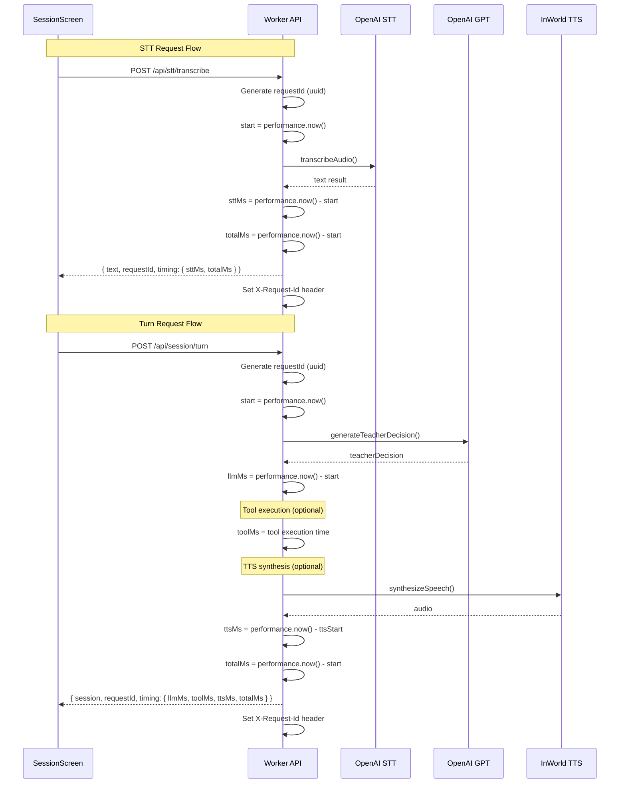

# Phase 8: Observability + Latency Instrumentation v1

**Date:** 2026-02-04
**Goal:** Add timing metrics and request IDs across STT and turns endpoints, display in SessionScreen debug panel.

---

## Summary

Add request-level observability to the application by:
1. Adding shared timing schemas for optional timing fields
2. Instrumenting `/api/stt/transcribe` with requestId and timing metrics
3. Instrumenting `/api/session/turn` with requestId and timing metrics
4. Adding a Debug toggle panel in SessionScreen to display timing data

**Constraints:**
- All timing metrics must be OPTIONAL to maintain backward compatibility
- No changes to tutor logic, tools, quiz scoring, or TTS behavior
- Must pass `pnpm build`, `lint`, and `typecheck`

---

## File Changes

### New Files
1. `packages/shared/src/schemas/timing.ts` - Shared timing schema definitions

### Modified Files
1. `packages/shared/src/schemas/stt.ts` - Add timing + requestId to STT response
2. `packages/shared/src/schemas/session.ts` - Add timing + requestId to Turn response
3. `packages/shared/src/index.ts` - Export timing schemas
4. `apps/worker/src/lib/openai-stt.ts` - Add instrumentation to STT handler
5. `apps/worker/src/lib/sessions-router.ts` - Add instrumentation to turn handler
6. `apps/ui/src/lib/api.ts` - Expose timing data from API responses
7. `apps/ui/src/screens/SessionScreen.tsx` - Add Debug toggle panel

---

## Implementation Details

### 1. Shared Timing Schema

**File:** `packages/shared/src/schemas/timing.ts`

```typescript
import { z } from 'zod';

/**
 * Timing metrics schema (all fields optional for backward compatibility)
 */
export const TimingSchema = z.object({
    /** Speech-to-text transcription duration in milliseconds */
    sttMs: z.number().optional(),
    /** LLM teacher decision generation duration in milliseconds */
    llmMs: z.number().optional(),
    /** Tool execution duration in milliseconds */
    toolMs: z.number().optional(),
    /** TTS synthesis duration in milliseconds */
    ttsMs: z.number().optional(),
    /** Total request handler duration in milliseconds */
    totalMs: z.number().optional(),
});

export type Timing = z.infer<typeof TimingSchema>;

/**
 * Request metadata schema
 */
export const RequestMetadataSchema = z.object({
    /** Unique request ID for tracing */
    requestId: z.string().uuid().optional(),
    /** Timing metrics for the request */
    timing: TimingSchema.optional(),
});

export type RequestMetadata = z.infer<typeof RequestMetadataSchema>;
```

### 2. STT Schema Update

**File:** `packages/shared/src/schemas/stt.ts`

Update `SttTranscribeResponseSchema` to include optional `requestId` and `timing`:

```typescript
export const SttTranscribeResponseSchema = z.object({
    text: z.string(),
    /** Unique request ID for tracing */
    requestId: z.string().uuid().optional(),
    /** Timing metrics */
    timing: TimingSchema.optional(),
});

export type SttTranscribeResponse = z.infer<typeof SttTranscribeResponseSchema>;
```

### 3. Session Schema Update

**File:** `packages/shared/src/schemas/session.ts`

Update `TurnResponseSchema` to include optional `requestId` and `timing`:

```typescript
export const TurnResponseSchema = z.object({
    session: SessionStateSchema,
    tts: TtsPayloadSchema.optional(),
    /** Unique request ID for tracing */
    requestId: z.string().uuid().optional(),
    /** Timing metrics */
    timing: TimingSchema.optional(),
});

export type TurnResponse = z.infer<typeof TurnResponseSchema>;
```

### 4. Export Timing Schemas

**File:** `packages/shared/src/index.ts`

```typescript
export * from './schemas/content';
export * from './schemas/session';
export * from './schemas/stt';
export * from './schemas/timing';  // NEW
```

### 5. STT Handler Instrumentation

**File:** `apps/worker/src/lib/openai-stt.ts`

```typescript
/**
 * Generate a UUID v4 for request tracking
 */
function generateRequestId(): string {
    return crypto.randomUUID();
}

/**
 * Handle POST /api/stt/transcribe with timing instrumentation
 */
export async function handleSttTranscribe(request: Request): Promise<Response> {
    const requestId = generateRequestId();
    const startTime = performance.now();
    
    try {
        // ... existing validation code ...
        
        // Perform transcription
        const sttStart = performance.now();
        const result = await transcribeAudio({
            audioBytes,
            mimeType,
            filename,
            language,
        });
        const sttEnd = performance.now();
        
        const sttMs = Math.round(sttEnd - sttStart);
        const totalMs = Math.round(performance.now() - startTime);
        
        const timing = {
            sttMs,
            totalMs,
        };
        
        console.log(`[STT] requestId=${requestId} sttMs=${sttMs} totalMs=${totalMs}`);
        
        return new Response(
            JSON.stringify(successResponse({
                text: result.text,
                requestId,
                timing,
            })),
            {
                status: 200,
                headers: {
                    'Content-Type': 'application/json',
                    'X-Request-Id': requestId,
                },
            }
        );
    } catch (error) {
        const totalMs = Math.round(performance.now() - startTime);
        console.error(`[STT] requestId=${requestId} error=${error} totalMs=${totalMs}`);
        
        return new Response(
            JSON.stringify(errorResponse('Transcription failed', error instanceof Error ? error.message : String(error))),
            {
                status: 500,
                headers: {
                    'Content-Type': 'application/json',
                    'X-Request-Id': requestId,
                },
            }
        );
    }
}
```

### 6. Session Router Instrumentation

**File:** `apps/worker/src/lib/sessions-router.ts`

Update `handleTurn` method:

```typescript
/**
 * Generate a UUID v4 for request tracking
 */
function generateRequestId(): string {
    return crypto.randomUUID();
}

export class SessionRouter {
    // ... existing code ...
    
    async handleTurn(request: Request): Promise<Response> {
        const requestId = generateRequestId();
        const startTime = performance.now();
        
        try {
            const body = await request.json() as TurnRequest;
            
            // ... existing validation ...
            
            // Process turn (measure LLM call within engine)
            const llmStart = performance.now();
            const session = await this.engine.processTurn(body.sessionId, body.userText);
            const llmEnd = performance.now();
            const llmMs = Math.round(llmEnd - llmStart);
            
            // Build response data
            const responseData: { 
                session: SessionState; 
                tts?: TtsPayload;
                requestId: string;
                timing?: Timing;
            } = { 
                session, 
                requestId,
            };
            
            let ttsMs: number | undefined;
            
            // Synthesize TTS if enabled and tutor replied
            if (body.ttsEnabled && session.lastDecision?.reply) {
                const ttsStart = performance.now();
                try {
                    const tts = await synthesizeSpeech({
                        text: session.lastDecision.reply,
                    });
                    if (tts) {
                        responseData.tts = tts;
                    }
                } catch (ttsError) {
                    // TTS is optional - log and continue without audio
                    console.warn(`[SessionRouter] TTS failed: ${ttsError}`);
                }
                const ttsEnd = performance.now();
                ttsMs = Math.round(ttsEnd - ttsStart);
            }
            
            const totalMs = Math.round(performance.now() - startTime);
            
            // Build timing object
            responseData.timing = {
                llmMs,
                ttsMs,
                totalMs,
            };
            
            console.log(`[SessionRouter] requestId=${requestId} llmMs=${llmMs} ttsMs=${ttsMs || 'n/a'} totalMs=${totalMs}`);
            
            return new Response(
                JSON.stringify(successResponse(responseData)),
                {
                    headers: {
                        'Content-Type': 'application/json',
                        'X-Request-Id': requestId,
                    },
                }
            );
        } catch (err) {
            const totalMs = Math.round(performance.now() - startTime);
            console.error(`[SessionRouter] requestId=${requestId} error=${err} totalMs=${totalMs}`);
            
            // ... existing error handling ...
            
            return new Response(
                JSON.stringify(errorResponse('Failed to process turn', message)),
                {
                    status: 400,
                    headers: {
                        'Content-Type': 'application/json',
                        'X-Request-Id': requestId,
                    },
                }
            );
        }
    }
}
```

### 7. UI API Updates

**File:** `apps/ui/src/lib/api.ts`

Update `transcribeAudio` and `sendSessionTurn` to return timing data:

```typescript
/**
 * Transcribe audio using the STT endpoint
 */
export async function transcribeAudio(
    sessionId: string | undefined,
    audioBlob: Blob,
    language?: string
): Promise<{ text: string; timing?: Timing; requestId?: string }> {
    // ... existing code ...
    
    const response = await fetch(apiUrl, {
        method: 'POST',
        body: formData,
    });
    
    // ... existing error handling ...
    
    const data = await response.json();
    
    // Return text along with optional timing data
    return {
        text: data.data.text as string,
        requestId: data.data.requestId,
        timing: data.data.timing,
    };
}

/**
 * Send a user message and get a tutor response
 */
export async function sendSessionTurn(
    sessionId: string,
    userText: string,
    ttsEnabled: boolean = false
): Promise<{
    session: SessionState;
    tts?: { mimeType: string; audioBase64: string };
    timing?: Timing;
    requestId?: string;
}> {
    return fetchApi<{
        session: SessionState;
        tts?: { mimeType: string; audioBase64: string };
        timing?: Timing;
        requestId?: string;
    }>(
        '/api/session/turn',
        {
            method: 'POST',
            body: JSON.stringify({ sessionId, userText, ttsEnabled }),
        }
    );
}
```

### 8. SessionScreen Debug Panel

**File:** `apps/ui/src/screens/SessionScreen.tsx`

Add debug panel state and UI:

```typescript
// Import Timing type
import type { Timing } from '@repo/shared';

export function SessionScreen() {
    // ... existing state ...
    
    // Debug panel state (default OFF)
    const [debugEnabled, setDebugEnabled] = React.useState(false);
    const [lastSttTiming, setLastSttTiming] = React.useState<{ timing?: Timing; requestId?: string } | null>(null);
    const [lastTurnTiming, setLastTurnTiming] = React.useState<{ timing?: Timing; requestId?: string } | null>(null);
    
    // ... existing handlers ...
    
    /**
     * Transcribe recorded audio and send as a session turn
     */
    const handleTranscribe = async (audioBlob: Blob) => {
        if (!sessionId) return;
        
        setTranscribing(true);
        
        try {
            // Transcribe the audio (now returns timing data)
            const sttResult = await transcribeAudio(sessionId, audioBlob, 'es');
            setLastSttTiming({
                timing: sttResult.timing,
                requestId: sttResult.requestId,
            });
            
            // Send the transcribed text as a user message (auto-send)
            await sendTranscribedMessage(sttResult.text);
        } catch (err) {
            // ... existing error handling ...
        }
    };
    
    /**
     * Send transcribed text as a session turn
     */
    const sendTranscribedMessage = async (text: string) => {
        if (!sessionId || sending) return;
        
        setSending(true);
        
        try {
            const data = await sendSessionTurn(sessionId, text, ttsEnabled);
            setSession(data.session);
            setLastTurnTiming({
                timing: data.timing,
                requestId: data.requestId,
            });
            
            // ... existing TTS handling ...
        } catch (err) {
            // ... existing error handling ...
        }
    };
    
    // Render
    return (
        <div className="session-screen">
            {/* ... existing UI ... */}
            
            {/* Debug Toggle */}
            <Toggle
                label="Debug"
                checked={debugEnabled}
                onChange={setDebugEnabled}
            />
            
            {/* Debug Panel */}
            {debugEnabled && (
                <DebugPanel
                    sttTiming={lastSttTiming}
                    turnTiming={lastTurnTiming}
                />
            )}
            
            {/* ... rest of UI ... */}
        </div>
    );
}

/**
 * Debug Panel Component
 */
function DebugPanel({ 
    sttTiming, 
    turnTiming 
}: { 
    sttTiming: { timing?: Timing; requestId?: string } | null;
    turnTiming: { timing?: Timing; requestId?: string } | null;
}) {
    return (
        <div className="debug-panel p-4 bg-gray-100 rounded-lg">
            <h3 className="font-bold mb-2">Request Debug Info</h3>
            
            {/* STT Timing */}
            {sttTiming && (
                <div className="mb-4">
                    <h4 className="font-semibold">STT Transcription</h4>
                    {sttTiming.requestId && (
                        <p className="text-xs font-mono">Request ID: {sttTiming.requestId}</p>
                    )}
                    {sttTiming.timing && (
                        <div className="text-sm">
                            <p>STT: {sttTiming.timing.sttMs ?? '—'}ms</p>
                            <p>Total: {sttTiming.timing.totalMs ?? '—'}ms</p>
                        </div>
                    )}
                </div>
            )}
            
            {/* Turn Timing */}
            {turnTiming && (
                <div>
                    <h4 className="font-semibold">Session Turn</h4>
                    {turnTiming.requestId && (
                        <p className="text-xs font-mono">Request ID: {turnTiming.requestId}</p>
                    )}
                    {turnTiming.timing && (
                        <div className="text-sm">
                            <p>LLM: {turnTiming.timing.llmMs ?? '—'}ms</p>
                            <p>Tool: {turnTiming.timing.toolMs ?? '—'}ms</p>
                            <p>TTS: {turnTiming.timing.ttsMs ?? '—'}ms</p>
                            <p>Total: {turnTiming.timing.totalMs ?? '—'}ms</p>
                        </div>
                    )}
                </div>
            )}
            
            {/* Empty state */}
            {!sttTiming && !turnTiming && (
                <p className="text-gray-500 text-sm">No requests yet. Try recording or sending a message.</p>
            )}
        </div>
    );
}
```

---

## Todo List

```
[-] Create timing schema file (packages/shared/src/schemas/timing.ts)
[ ] Update STT response schema (packages/shared/src/schemas/stt.ts)
[ ] Update Turn response schema (packages/shared/src/schemas/session.ts)
[ ] Export timing schemas from shared package (packages/shared/src/index.ts)
[ ] Instrument STT handler with requestId + timing (apps/worker/src/lib/openai-stt.ts)
[ ] Instrument turn handler with requestId + timing (apps/worker/src/lib/sessions-router.ts)
[ ] Update UI API functions to return timing data (apps/ui/src/lib/api.ts)
[ ] Add Debug toggle and panel to SessionScreen (apps/ui/src/screens/SessionScreen.tsx)
[ ] Run pnpm build to verify no errors
[ ] Run lint to verify code quality
[ ] Run typecheck to verify type safety
```

---

## Mermaid: Request Flow with Instrumentation



---

## Quality Gates

1. **pnpm build** - Must pass without errors
2. **pnpm lint** - Must pass with no warnings
3. **pnpm typecheck** - Must pass with no type errors
4. **Backward compatibility** - All timing/requestId fields are optional
5. **No behavior changes** - Tutor logic, tools, quiz scoring, and TTS behavior remain unchanged
